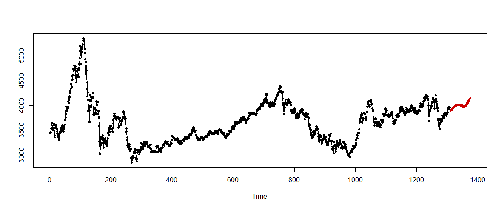
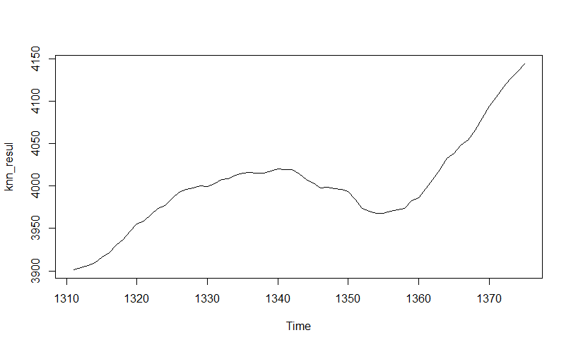

##
<font size=6>
**演讲内容**
</font>
<br/>

#### 1.绪论

#### 2.描述性分析

#### 3.基于VAR曲线的收益风险预警

#### 4.基于Egarch模型预测

#### 5.基于Knn方法预测

#### 6.展望


<br/>
<br/>
<br/>
<br/>


# 1.绪论
##
<font size=6>
**1.1 研究背景**
</font>

- 2020年初，新冠肺炎疫情给中国带来了巨大的挑战。面对严峻形势，2020年2月10日，习近平总书记在北京调研指导新冠肺炎疫情防控工作时强调“以更坚定的信心、更顽强的意志、更果断的措施，坚决打赢防控的人民战争、总体战、阻击战”。显示出国家对于疫情防控的坚定决心和“始终把人民群众生命安全和身体健康放在首位，全力以赴救治患者”的疫情防控理念。

- 在积极应对疫情的时候也要认识到这次疫情给经济带来的巨大冲击。已有研究显示，类似于新冠肺炎疫情这类突发大规模疫情对于社会经济综合影响往往更需要被关注，其影响涉及国家、地区发展和人民生活水平等各个经济层面（李正全2003）。突发大规模疫情往往表现为爆发突然、传播速度快、影响区域相对集中、社会恐慌程度高等特点（Fang L Q et al.，2009）。因此该类疫情也表现出短期经济和特定产业影响特征，对长期经济影响相对有限，疫情后经济恢复能力较强。

- 金融市场尤其是股票市场受到投资者的情绪影响程度较大。新冠肺炎疫情极大地影响力投资者的信心以及投资者对经济基本面的悲观预期使疫情发生以来我国的股票市场发生大幅震荡，当新冠肺炎疫情在全球快速蔓延后，美国等国家的金融市场也发生大幅震荡


##

<font size=6>
**1.2 文献综述**
</font>

-  李正全.SARS影响国民经济的短期与长期分析[J].经济科学，2015(3)
- 张文斗,祖正虎,许晴,等.突发大规模疫情对经济的影响分析[J].军事医学,2014(2)


- Egarch模型预测参考

https://blog.csdn.net/weixin_30565199/article/details/97739736
https://bbs.pinggu.org/thread-5491300-1-1.html
https://www.cnblogs.com/xuruilong100/p/10404054.html

- Knn模型预测参考

https://cran.r-project.org/web/packages/tsfknn/vignettes/tsfknn.html      https://github.com/vipulmayank/GoogleStockPriceForecasting_COVID19


##
<font size=6>
**1.2 数据来源**
</font>

- 从大智慧股票软件上下载沪深300、标普500指数股票数据
- 从狗熊会公众号中下载全国疫情数据
- 从狗熊会公众号中下载美国疫情数据

<br/>
<br/>
<br/>
<br/>


# 2.描述性分析
##
<font size=6>

**2.1国内生产总值环比增长速度**
</font>

<div align=center>


</div>

<br/>
<br/>
<br/>
<br/>


##

<font size=6>

**2.2社会消费品零售总额累计增长率**
</font>

<div align=center>


</div>


##
<font size=6>

**2.3新冠疫情发生以来沪深300指数**
</font>

<div align=center>


</div>

<br/>
<br/>
<br/>
<br/>


##
<font size=6>

**2.4中国新冠肺炎新增确诊人数**
</font>

<div align=center>


</div>

<br/>
<br/>
<br/>
<br/>

##
<font size=6>

**2.4中国新冠肺炎新增确诊人数**
</font>

<div align=center>


</div>

<br/>
<br/>
<br/>
<br/>

##
<font size=6>

 **2.5标普500指数收盘价**
</font>

<div align=center>


</div>

<br/>
<br/>
<br/>
<br/>

##
<font size=6>

**2.6美国新冠肺炎新增确诊人数**
</font>

<div align=center>


</div>

<br/>
<br/>
<br/>
<br/>


# 3.基于VAR曲线的收益风险预警
```{r setup, include=FALSE}
knitr::opts_chunk$set(echo = TRUE)
```

##
<font size=6>
**3.1 前言 **
</font>

这部分我将通过度量股票指数收益率的波动性，进一步研究疫情给我国股票市场带来的不确定性和风险性。首先我运用GARCH模型拟合了股票指数收益率的波动性方程，并实证研究了在中国具有一定代表性的沪深300指数在疫情冲击下的波动情况。结果表明我国股票市场在疫情期间受到了持续性的冲击。具体而言我国股票市场对利好利坏消息均敏感，表明了我国股票市场抗击风险的薄弱性。此外，我尝试使用SGARCH模型对股票收益率序列进行滚动预测，基于Var曲线的研究表明，在疫情爆发初始股市就已经发出了危机预警信号。
 
##
<font size=6>
**3.2 实际操作**
<font>

##
<font size = 6>
**3.2.1 包载入与数据预处理**
<font>

```{r,echo = T, eval = T}
#包载入
library(fGarch)
library(rugarch)#garch拟合与预测
library(TSA)#BIC准则确定arma阶数  eacf确定garch阶数
library(tseries)
library(zoo)#转换成时间序列类型
library(forecast)#auto.arima() arma阶数确定方法
library(psych)#数据描述统计分析
library(ggplot2)#绘图
library(ccgarch)#JB统计量
```


```{r}

#数据预处理
StockData<-read.csv("E://assignment2//project//midproject//data//hushen300.csv",encoding='utf-8',header = T)  #header = Falese 
time<-as.Date(StockData$'time',format="%Y/%m/%d")
closeprice<-StockData$'closeprice'
data<-zoo(closeprice,time)
#选中局部数据
selectdata=window(data, start = as.Date("2015-05-01"), end = as.Date("2020-05-01"))
plot(selectdata,xlab="time",ylab="index",main="CSI 300 index")
rlog=log(selectdata)
rlogdiff=diff(log(selectdata))*100 #数据转换
rlogdifftime=index(rlogdiff)
rlogdiffdata=coredata(rlogdiff)
```

波动图表明，自2020年初新冠肺炎疫情爆发开始，我国沪深300指数收益率就表现出了一定程度的波动。

##
<font size = 6>
**3.2.2 正态性检验**
<font>

```{r}
par(mfrow=c(1,3),oma=c(0.2,0.2,0.2,0.2))
hist(rlogdiff,main="CSI 300 index Log Return Distribution",col="yellow",xlab="",ylim=c(0,0.4),probability=T)
lines(density(rlogdiff),lwd=1);rug(rlogdiff)#first graph
qqnorm(rlogdiff);qqline(rlogdiff)#second graph
plot(rlogdiff,ylab="value");abline(h=0,lty=2)#third graph
```

上图为数据分布函数，QQ图，对数收益率序列折现图。由数据分布图、QQ图可以看出金融时间序列确实表现出尖峰厚尾性，相对于标准正态分布，峰度更高，两段的尾部更厚，也就是极值更多。由收益率波动序列可以看出各国股票指数收益率序列在样本区间内均表现出一定的波动性和聚集性，其中2015-2016年、2020年初波动幅度尤为明显。

##
<font size = 6>
**3.2.3 平稳性检验**
<font>

```{r}
library(tseries)
library(TSA)
#若 ADF  p<0.01  认为序列是均值回归的
adf.test(rlog,alt="stationary")#注意  这是未差分的数据
adf.test(rlogdiffdata,alt="stationary")#这是差分后的数据

#得先arima拟合模型，对残差进行LM检验
armamodel=auto.arima(rlogdiff)#自动基于AIC最小准则，寻找最佳拟合模型
armamodel
plot(residuals(armamodel))
par(mfrow=c(1,1))
lmresult=McLeod.Li.test(y=residuals(armamodel))#残差arch效应很显著
```

当p<0.01时认为序列平稳
由图可知，残差序列滞后30阶后，残差自回归函数的系数显著，序列仍然存在自相关。因此拒绝原假设，说明样本序列存在显著的ARCH效应。
综上，对数收益率序列具有波动聚集性，序列平稳，有显著ARCH效应。序列适合GARCH模型建模。

##
<font size = 6>
**3.2.4 模型拟合**
<font>


我分别使用了SGARCH与EGARCH模型拟合序列。但由于是EGARCH能分析收益率序列的“杠杆效应”此处以EGARCH做演示。

```{r}
myspec=ugarchspec(
  variance.model = list(model = "eGARCH", garchOrder = c(1, 1)),
  mean.model = list(armaOrder = c(0,0), include.mean = TRUE),
  distribution.model = "std"
)

myfit=ugarchfit(myspec,data=rlogdiff,solver="gosolnp")
myfit
```

##
<font size = 6>
**3.2.5 模型诊断**
<font>


```{r}
#残差正态性检验
plot(myfit,which=8)
plot(myfit,which=9)
shapiro.test(coredata(residuals(myfit)))#值越大，越表示不是正态，P越小越非正态
#残差相关性检验
acf(coredata(residuals(myfit)))
acf(residuals(myfit))
plot(myfit,which=10)
plot(myfit,which=11)
#系数是否显著
myfit #看P值是否够小
#拟合效果  残差如何
plot(myfit,which=3)
plot(residuals(myfit)) #看残差

plot(myfit,which=12)
```

从上图可以看出,沪深300指数收益率在信息冲击小于零（即利坏消息或负冲击）和信息冲击大于零（即利好消息或正冲击时）时都比较陡峭，表明沪深300指数对消息敏感，抗风险能力较弱，这也间接说明沪深300指数非常适合用于研究疫情对我国股票市场带来的冲击。

##
<font size = 6>
**3.2.6 基于VAR曲线的收益风险预警**
<font>


股票指数收益率计算公式为r_t=ln（e_(t))-ln(e_(t-1))，其中r_t为股票指数收益率，e_t和e_(t-1)分别为第t期和（t-1）期的股票指数收盘价.
股票对数收益率通常存在着一定的波动聚集性，而大波动并不是突然发生的，是由于某些原因带来的冲击的影响，大波动发生之前也应该有相应信号出现，比如异常低的收益率。
```{r}
spec = ugarchspec(variance.model = list(model = "sGARCH"), distribution.model = "std")
cl = makePSOCKcluster(10)
#滚动预测
roll = ugarchroll(spec, rlogdiff, n.start =300,refit.every = 300,
                  refit.window = "moving", solver = "hybrid", calculate.VaR = TRUE,
                  VaR.alpha = c(0.01, 0.025, 0.05), cluster = cl,keep.coef = TRUE)

report(roll, type = "fpm")

plot(roll,which=4,VaR.alpha=0.01)
```

由上图可知在较大波动率之前确实有一些点落在Var曲线以下（标注为红点）。但在波动平稳期，模型预警正确率不高（如2017年10月到2019年1月）所以该模型在波动率非平稳期有一定参考价值。
<br/>
以沪深300指数为例，在2020年初开始有个别点落在了var曲线以下这与新冠肺炎的出现时间相吻合。可见，沪深300指数的大跌在疫情出现之前是有留下一定信号的。


<br/>
<br/>
<br/>
<br/>


# 4.基于Egarch模型预测


##
<font size=6>
**4.1 rugarch包介绍 **
</font>


 - 该模型由三个部分构成，均值方程对应式（1），分布假设对应（2），方差方程对应式（3），对三个部分进行适当的变形后可以形成egarch模型，egarch-ged模型，egarch-t模型，Igarch模型，garch-m模型和Qgarch模型等。因此，设定模型形式就是分别设定均值方程、方差方程和分布。


 - rugarch包的优越之处正在于这里。ugarchspec函数的参数也被分解为为三个主要部分，分别是variance.model，对应式（3），mean.model，对应式（1），distribution.model对应式（2）中的$\epsilon$。通过对三个部分的参数的分别设定从而构造出自己想用的模型。
 
 
$r_{t}=c_1+\sum_{i=1}^{R}\phi_{i}r_{t-i}+\sum_{j=1}^{M}\phi_{j}ϵ_{t-j}+ϵ_{t}$(1)

$ϵ_{t}=\mu_{t}\sqrt{h_{t}}$(2)

$h_{t}=k+\sum_{i=1}^{q}G_{i}h_{t-i}+\sum_{i=1}^{p}A_{i}{ϵ_{t-i}}^2$(3)


##
<font size=6>
**4.2 预测过程 **
</font>


- 载入包
```{r, echo = T, eval = F}

library (fBasics)
library (rugarch)#garch拟合与预测
library (forecast)#auto.arima() arma阶数确定方法
library (ggplot2)#绘图
```

```{r, echo = F, eval = T}

library(fBasics)
library(rugarch)#garch拟合与预测
library(forecast)#auto.arima() arma阶数确定方法
library(ggplot2)#绘图
``` 

##
<font size=6>
**4.2预测过程**
</font>


- 载入数据
```{r echo=T, out.width = '80%'}
HS <- read.csv ("E://assignment2//project//midproject//data//hushen300.csv")
##计算对数收益率
dHS <- diff (log(HS$closeprice))
head (dHS)
```


 - 2016年2月4日-2020年5月15日沪深300指数为数据，一共有1042个数据。


 
 
##
<font size=6>
**4.2预测过程**
</font>


- ARMA定阶
```{r echo=T, out.width = '80%'}
forecast::ggtsdisplay (dHS)
```


##
<font size=6>
**4.2预测过程**
</font>
 
 
 - 建模
```{r, echo = T, eval = T}
myspec = ugarchspec(
  variance.model = list(model = "eGARCH", garchOrder = c(1, 1)),
  mean.model = list(armaOrder = c(4,4), include.mean = TRUE),
  distribution.model = "std"
)
myfit = ugarchfit ( myspec, data=dHS, solver = "gosolnp" )
myfit
```

##
<font size=6>
**4.2预测过程**
</font>
 
 
 - 建模
```{r, echo = T, eval = F}
myspec = ugarchspec(
  variance.model = list(model = "eGARCH", garchOrder = c(1, 1)),
  mean.model = list(armaOrder = c(4,4), include.mean = TRUE),
  distribution.model = "std"
)
myfit = ugarchfit ( myspec, data=dHS, solver = "gosolnp" )
myfit
```
 
 - model 是一个字符串，指定拟合哪种类型的 GARCH 模型。包支持许多主要的 GARCH 模型（例如 EGARCH、IGARCH 等），对于“普通”GARCH 模型，要将其设置为 sGARCH（或者只是忽略它，标准模型是默认的)，此处设置为为 EGARCH。
 garchOrder 是模型中 ARCH 和 GARCH 部分的阶数向量。


 - mean.model 允许拟合 ARMA-GARCH 模型，并且像 variance.model 一样接受一个命名列表，最感兴趣的参数是 armaOrder 和 include.mean。armaOrder 就像 garchOrder，它是一个指定 ARMA 模型阶数的向量。include.mean 是一个布尔值，如果为 true，则允许模型的 ARMA 部分具有非零均值。


##
<font size=6>
**4.3预测结果**
</font>


 - 预测20个工作日的数据，即2020年5月16日-2020年6月4日的数据。
```{r echo=T, out.width = '80%'}
 forc = ugarchforecast ( myfit, n.ahead = 20)
forc
```


##
<font size=6>
**4.3预测结果**
</font>


 - 数据还原
 
 
 - 数据建模之前进行平稳化化处理，去除了趋势（差分取对数），因此对数据还原，方便观察。
```{R}
 t = forc@forecast [["seriesFor"]]
 m = HS$closeprice [1042]
  x=t
  x[1] = m + exp(t[1])
 for (i in 2:20) {
    x[i] = x[i-1]+ exp(t[i])
 }
date = c("2020/5/16", "2020/5/17", "2020/5/18","2020/5/19", "2020/5/20", "2020/5/21", "2020/5/22", "2020/5/23", "2020/5/24", "2020/5/25", "2020/5/26", "2020/5/27", "2020/5/28", "2020/5/29", "2020/5/30", "2020/5/31", "2020/6/1", "2020/6/2", "2020/6/3", "2020/6/4")
xx = data.frame (date,x)
names (xx) = c("time","closeprice")
xl = rbind(HS,xx)
```


##
<font size=6>
**4.3预测结果**
</font>


 - 从预测的结果来看，在未来20个工作日内，股票价格将持续上升。
 
 
 - 从5月16日的 3913 上升到6月4日的 3932
```{R}
ggplot (xx, mapping = aes (x = time , y = closeprice, group=1))+ geom_line()
```


##
<font size=6>
**4.3预测结果**
</font>


 - 时序图
```{R}
plot (ts ( xl$closeprice))

```
<br/>
<br/>
<br/>
<br/>

# 5.基于knn模型预测


##
<font size=6>
**5.1 tsfknn介绍 **
</font>

 - R软件中的tsfknn包仅用于KNN模型对单个变量的时间序列进行预测，其可以选择不同的预测点数和不同的最近邻个数确定预测的结果。
 - 预测类型：向前预测一个点；向前预测多个点,可以通过设置参数msas选择不同的方法，包括MIMO方法和迭代法，这两种方法在预测一个未来值时，方法是等价的。本文选择的是设置参数为MIMO
 - 预测示例：
```{r,  echo = T, eval = FALSE}
library(tsfknn)
pred <- knn_forecasting(ts(1:120), h = 12, lags = 1:12, k = 2, msas = "MIMO")
#模型评估
ro <- rolling_origin(pred, h = 12)
ro$global_accu
#预测过程展示
library(ggplot2)
library(ggfortify)
autoplot(pred, highlight = "neighbors", faceting = FALSE)
```

##
<font size=6>
**5.2 实际预测结果 **
</font>
```{r, echo = T, eval = F}
predknn_after_covid <- knn_forecasting(data_time, h = 65, lags = 1:30, k = 36, msas = "MIMO")
```

```{r echo=FALSE, out.width = '100%'}

```


 - 实际数据部分是2014.12.26-2020.5.15的数据，预测部分是2020.5.16-2020.7.19日的股票指数
 
 
##
<font size=6>
**5.2实际预测结果**
</font>

```{r echo=FALSE, out.width = '80%'}

```


 - 在预测过程中，k取数据点数的平方根1310 *（1/2）= 36, 滞后特征数的设置为30，向前预测65天
 - 从上的趋势图中可以看到5月15号(1310期）以后的趋势整体呈上升的趋势，但是在6月15号-6月28号左右（即图中的1340-1355期）存在明显的下降。
 - 通过knn模型的拟合，发现疫情期间股票价格明显下降，从疫情基本结束之后，股票已开始出现逐渐回升

 
##
<font size=6>
**5.2实际预测结果**
</font>
<div align=center>

</div>

 - 从实际数据图与预测结果图对比，可以更加明显的看到时间长度的不同
 
 
##
<font size=6>
**5.3预测过程**
</font>

```{r echo=FALSE, out.width = '100%'}
knitr::include_graphics("./g4.png")
```


 - Instance表示未来预测点的特征，NN Features表示选择的36组最相似点的特征，NN  Targets表示找到的最相似的36组点，每组预测数据都是对最相似的36组点的进行加权平均得到
 
##
<font size=6>
**5.4估计误差**
</font> 
<br/>
<br/>


|RMSE|MAE|MAPE|
|:-:|:-:|:-:|
|206.45|164.39|4.34|
<br/>
RMSE表示均方根误差、MAE表示平均绝对误差、MAPE表示平均绝对百分比误差。由于MAPE的数值是相对数，会比其他两个指标小很多。

<br/>
<br/>
<br/>
<br/>

# 6.展望

##
<font size=6>
**6.1 模型改进 **
</font>

&emsp;&emsp;（1）此次报告采用的模型Egarch模型预测股票属于传统模型，knn方法预测是将之前的值作为下一个点的特征，可能与实际情况相比，存在差异，因此，之后会尝试其他更为前沿的模型  

&emsp;&emsp;（2）此次报告仅仅是对不同模型的应用，之后会对不同模型的预测效果进行对比，选择效果较好的模型作为最终结果。

<br/>
<br/>
<br/>
<br/>

# Thank you!

 