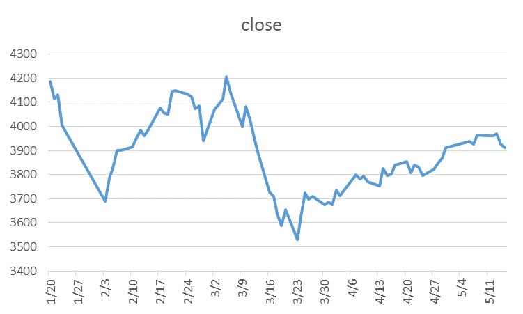
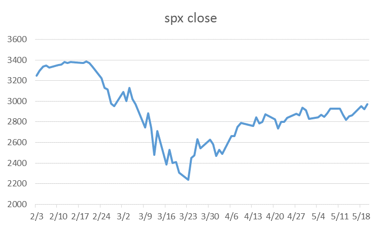

##
 

**演讲内容**

 

#### 1.绪论

 

#### 2.描述性分析

 

#### 3.基于Egarch模型预测

 

#### 4.基于VAR曲线的收益风险预警

 

#### 5.基于Knn方法预测

 

#### 6.结论与展望

 
 
 
 

# 1.绪论
##
 
 

**1.1 研究背景**

- 2020年初，新冠肺炎疫情给中国带来了巨大的挑战。面对严峻形势，2020年2月10日，习近平总书记在北京调研指导新冠肺炎疫情防控工作时强调“以更坚定的信心、更顽强的意志、更果断的措施，坚决打赢防控的人民战争、总体战、阻击战”。显示出国家对于疫情防控的坚定决心和“始终把人民群众生命安全和身体健康放在首位，全力以赴救治患者”的疫情防控理念。

- 在积极应对疫情的时候也要认识到这次疫情给经济带来的巨大冲击。已有研究显示，类似于新冠肺炎疫情这类突发大规模疫情对于社会经济综合影响往往更需要被关注，其影响涉及国家、地区发展和人民生活水平等各个经济层面（李正全2003）。突发大规模疫情往往表现为爆发突然、传播速度快、影响区域相对集中、社会恐慌程度高等特点（Fang L Q et al.，2009）。因此该类疫情也表现出短期经济和特定产业影响特征，对长期经济影响相对有限，疫情后经济恢复能力较强。

- 金融市场尤其是股票市场受到投资者的情绪影响程度较大。新冠肺炎疫情极大地影响力投资者的信心以及投资者对经济基本面的悲观预期使疫情发生以来我国的股票市场发生大幅震荡，当新冠肺炎疫情在全球快速蔓延后，美国等国家的金融市场也发生大幅震荡

##
 
 

**1.2 文献综述**

-  李正全.SARS影响国民经济的短期与长期分析[J].经济科学，2015(3)
- 张文斗,祖正虎,许晴,等.突发大规模疫情对经济的影响分析[J].军事医学,2014(2)

- Egarch模型预测参考

https://blog.csdn.net/weixin_30565199/article/details/97739736
https://bbs.pinggu.org/thread-5491300-1-1.html
https://www.cnblogs.com/xuruilong100/p/10404054.html

- Knn模型预测参考

https://cran.r-project.org/web/packages/tsfknn/vignettes/tsfknn.html      https://github.com/vipulmayank/GoogleStockPriceForecasting_COVID19

##
 
 

**1.2 数据来源**

- 从大智慧股票软件上下载沪深300、标普500指数股票数据
- 从狗熊会公众号中下载全国疫情数据
- 从狗熊会公众号中下载美国疫情数据

 
 
 
 

# 2.描述性分析
##
 
 

**2.1国内生产总值环比增长速度**

 
 
 
 

##
 
 

**2.2社会消费品零售总额累计增长率**

##
 
 

**2.3新冠疫情发生以来沪深300指数**

 
 
 
 

##
 

**2.4中国新冠肺炎新增确诊人数**

 
 
 
 

##
 

**2.4中国新冠肺炎新增确诊人数**

 
 
 
 

##
 

 **2.5标普500指数收盘价**

 
 
 
 

##
 

**2.6美国新冠肺炎新增确诊人数**

 
 
 
 