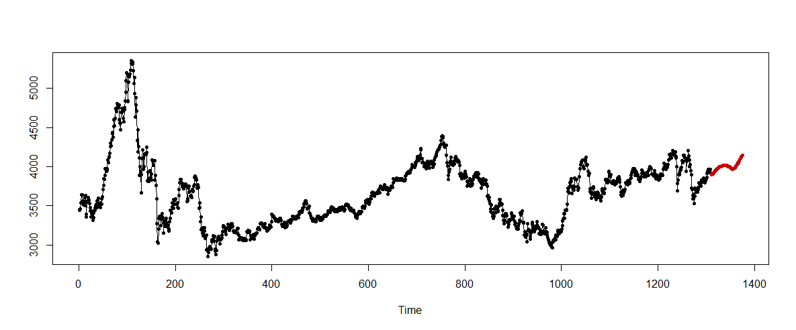
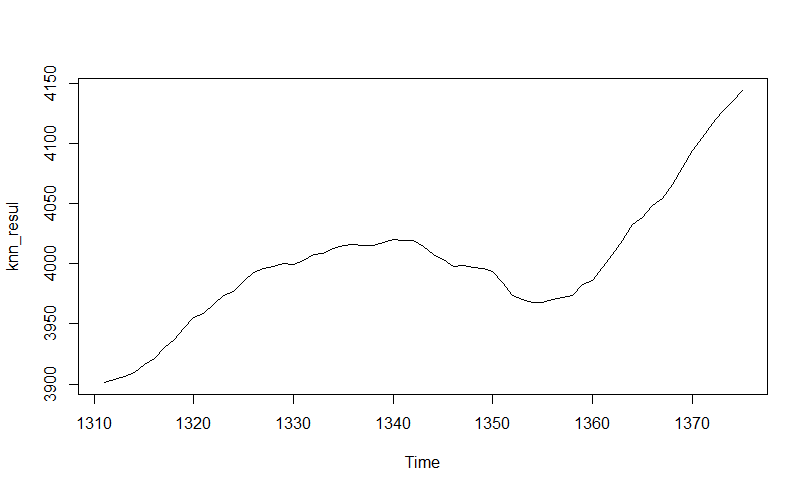
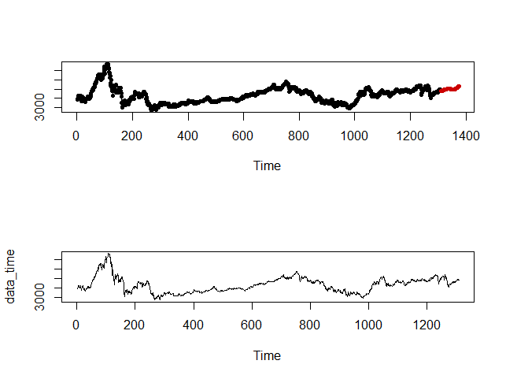
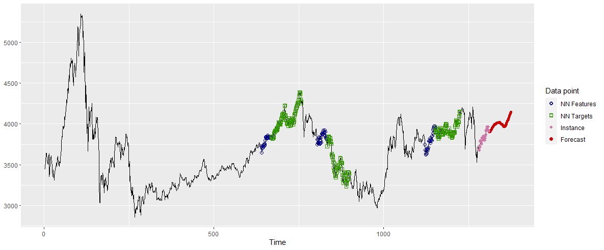

<br/>
<br/>
<br/>
<br/>

# 5.knn预测


##
<font size=6>
**5.1 tsfknn介绍 **
</font>

 - R软件中的tsfknn包仅用于KNN模型对单个变量的时间序列进行预测，其可以选择不同的预测点数和不同的最近邻个数确定预测的结果。
 - 预测类型：向前预测一个点；向前预测多个点,可以通过设置参数msas选择不同的方法，包括MIMO方法和迭代法，这两种方法在预测一个未来值时，方法是等价的。本文选择的是设置参数为MIMO
 - 预测示例：
```{r,  echo = T, eval = FALSE}
library(tsfknn)
pred <- knn_forecasting(ts(1:120), h = 12, lags = 1:12, k = 2, msas = "MIMO")
#模型评估
ro <- rolling_origin(pred, h = 12)
ro$global_accu
#预测过程展示
library(ggplot2)
library(ggfortify)
autoplot(pred, highlight = "neighbors", faceting = FALSE)
```

##
<font size=6>
**5.2 实际预测结果 **
</font>
```{r, echo = T, eval = F}
predknn_after_covid <- knn_forecasting(data_time, h = 65, lags = 1:30, k = 36, msas = "MIMO")
```

```{r echo=FALSE, out.width = '100%'}

```


 - 实际数据部分是2014.12.26-2020.5.15的数据，预测部分是2020.5.16-2020.7.19日的股票指数
 
 
##
<font size=6>
**5.2实际预测结果**
</font>
```{r echo=FALSE, out.width = '80%'}

```


 - 在预测过程中，k取数据点数的平方根1310 *（1/2）= 36, 滞后特征数的设置为30，向前预测65天
 - 从上的趋势图中可以看到5月15号(1310期）以后的趋势整体呈上升的趋势，但是在6月15号-6月28号左右（即图中的1340-1355期）存在明显的下降。
 - 通过knn模型的拟合，发现疫情期间股票价格明显下降，从疫情基本结束之后，股票已开始出现逐渐回升

 
##
<font size=6>
**5.2实际预测结果**
</font>
<div align=center>

</div>

 - 从实际数据图与预测结果图对比，可以更加明显的看到时间长度的不同
 
 
##
<font size=6>
**5.3预测过程**
</font>

```{r echo=FALSE, out.width = '100%'}

```


 - Instance表示未来预测点的特征，NN Features表示选择的36组最相似点的特征，NN  Targets表示找到的最相似的36组点，每组预测数据都是对最相似的36组点的进行加权平均得到
 
##
<font size=6>
**5.4估计误差**
</font> 
<br/>
<br/>


|RMSE|MAE|MAPE|
|:-:|:-:|:-:|
|206.45|164.39|4.34|
<br/>

RMSE表示均方根误差、MAE表示平均绝对误差、MAPE表示平均绝对百分比误差。由于MAPE的数值是相对数，会比其他两个指标小很多。

<br/>
<br/>
<br/>
<br/>

# 6.展望

##
<font size=6>
**6.1 模型改进 **
</font>

&emsp;&emsp;（1）此次报告采用的模型Egarch模型预测股票属于传统模型，knn方法预测是将之前的值作为下一个点的特征，可能与实际情况相比，存在差异，因此，之后会尝试其他更为前沿的模型

&emsp;&emsp;（2）此次报告仅仅是对不同模型的应用，之后会对不同模型的预测效果进行对比，选择效果较好的模型作为最终结果。

<br/>
<br/>
<br/>
<br/>

# Thank you!

 