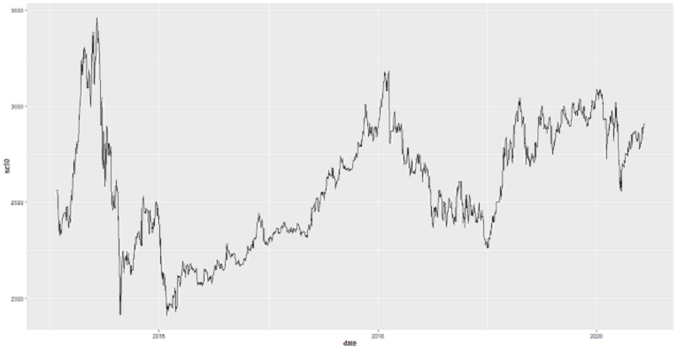
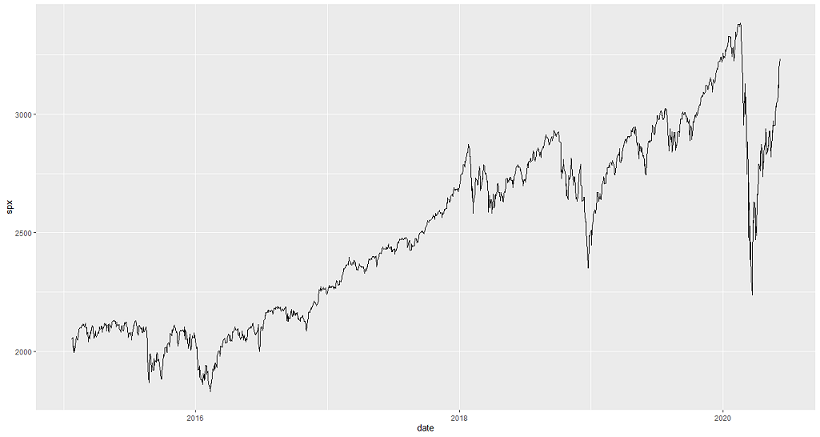
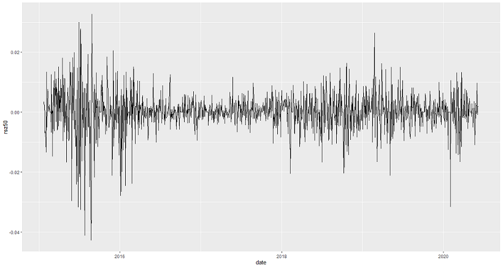
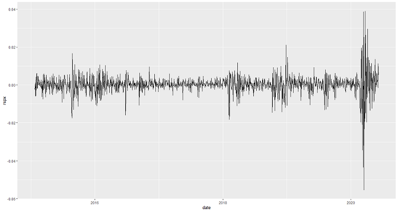

##
 

**演讲内容**

 

#### 1.绪论

 

#### 2.基于DCC-GARCH模型中美股市联动分析

 

#### 3.基于GARCH模型和VAR曲线的收益风险预警

 

#### 4.基于Egarch模型预测

 
 
 
 

# 1.绪论
##
 
 

**1.1 研究背景**

- 2020年初，新冠肺炎疫情给中国带来了巨大的挑战。面对严峻形势我们付出最大的努力防控疫情但是在积极应对疫情的时候也要认识到这次疫情给经济带来的巨大冲击。突发大规模疫情往往表现为爆发突然、传播速度快、影响区域相对集中、社会恐慌程度高等特点（Fang L Q et al.，2009）。

- 金融市场尤其是股票市场受到投资者的情绪影响程度较大。新冠肺炎疫情极大地影响了投资者的信心以及投资者对经济基本面的悲观预期使疫情发生以来我国的股票市场发生大幅震荡，当新冠肺炎疫情在全球快速蔓延后，美国等国家的金融市场也发生大幅震荡

##
 
 

**1.2 文献综述**

-  李倩,张潇尹.基于DCC-GARCH模型的我国股市风险传染效应[J].沈阳工业大学学报(社会科学版),2018,11(01):38-45.
-  王儒奇.中美贸易摩擦影响我国股市波动的实证研究——基于GARCH-VaR模型[J].区域金融研究,2019(07):51-56.

 
 
 
 

# 2.基于DCC-GARCH模型中美股市联动分析
##
 
 

**2.1DCC-GARCH模型介绍**

- Engle(2002)提出运用DCC-GARCH模型来测度不同时间序列数据之间的相互联动关系
- DCC的估计包括两个步骤：
- (1)估计每个变量的GARCH模型得到残差（ut)  
- (2)使用(1)中残差的无条件方差矩阵(Qt)计算动态相关系数矩阵(Rt)
- DCC结果中，系数lambda1+lambda2<1说明模型稳定，即动态相关关系有效，且lambda1+lambda2的值越接近于1说明动态关系越强。
 
 
 
 

##
 
 

**2.2样本选择和数据预处理**

- 样本选择：
- 上证50指数
- 标普500指数
- 数据预处理原因：
- 1.中美两国股票市场开盘时间不同步
- 2.中美两国法定节假日不同
- 数据预处理方法
- 1.以北京时间为准，将美国股票市场t-1日的交易数据与中国股票市场t日的交易数据进行对齐，以此解决时间不同步的问题。
- 2.运用数据插补方法，解决因节假日不同造成的交易日数据缺失。
 
 
 
 

##
 

**2.3上证50指数收盘价时序图**

##
 

**2.4标普500指数收盘价时序图**

##
 

**2.5上证50指数收益率时序图**

##
 

**2.6标普500指数收益率时序图**

##

**2.7DCC-GARCH模型参数**
 
 
 

index|Coef|p
--|:--:|--:
lambda1|0.0411813|0.084
lambda2|0.7307631|0.00
Correlation|0.1610168|0.00
-疫情发生前上证50指数和标普500指数日收益率DCC_GARCH模型参数结果
-lambda1+lambda2=0.0411813+0.7307631=0.771944

index|Coef|p
--|:--:|--:
lambda1|0.0432646|0.046
lambda2|0.7890817|0.00
Correlation|0.1689277|0.00
-疫情发生后上证50和标普500指数日收益率DCC_GARCH模型参数结果
-lambda1+lambda2=0.0432646+0.7890817=0.8323463
 
 
 
 

