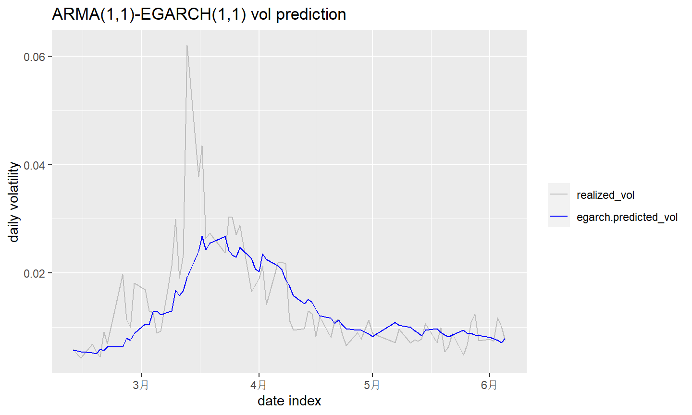

# 摘要
&emsp;&emsp;本文采用DCC-GARCH模型计算中国和美国股票市场收益率的联动相关系数，以此研究两国股票市场的联动效应，考察2015年1月至2020年6月中美两国股市共同波动变化程度。为有效度量自疫情发生以来我国股票市场上表现出的的不确定性和风险性，本文运用GARCH族模型拟合了股票指数收益率的波动性方程并实证研究了全球有代表性的美国标准普尔指数、香港恒生指数、日本日经指数和我国的沪深300指数。结果表明四个指数股票收益率均有聚集性、持续性，股票市场存在着冲击的非对称性。具体而言，美国、日本、中国香港股票市场对利坏消息敏感，而对利好消息保持谨慎。而沪深300指数代表的我国股市对利好利坏消息均敏感，体现出我国股票市场抗风险能力的薄弱性。此外，本文尝试使用SGARCH模型对股票收益率序列进行滚动预测，同时文章首创性的基于Var曲线提出了股市危机预警信号。研究表明在疫情爆发初始股市就已经发出了危机预警信号。

# 1 引言 

&emsp;&emsp;2020年初，新冠肺炎疫情给中国带来了巨大的挑战。面对严峻形势我们付出最大的努力防控疫情但是在积极应对疫情的时候也要认识到这次疫情给经济带来的巨大冲击。突发大规模疫情往往表现为爆发突然、传播速度快、影响区域相对集中、社会恐慌程度高等特点  
&emsp;&emsp;金融市场尤其是股票市场受到投资者的情绪影响程度较大。新冠肺炎疫情极大地影响了投资者的信心以及投资者对经济基本面的悲观预期使疫情发生以来我国的股票市场发生大幅震荡，当新冠肺炎疫情在全球快速蔓延后，美国等国家的金融市场也发生大幅震荡

# 2 模型介绍
## 2.1 DCC-GARCH模型
&emsp;&emsp;Engle(2002)在文章首次提出可以运用DCC-GACH模型(Dynamic Conditional Correlational Autoregressive Conditional Heteroscedasticity Model)，即动态相关多变量广义自回归条件异方差模型来度量两个或者多个不同时间序列数据的动态波动相关性。该模型放宽了CCC-GARCH模型中对时间序列数据相关性的波动系数为常数的假设条件。认为实际情况下时间序列波动是时变的。在这篇论文发表后，国内外很多专家学者不断对其理论进行丰富和扩充，逐渐建立起关于DCC-GARCH模型成熟完善的理论体系。模型可通过下列公式刻画：
```{r echo=FALSE, out.width = '100%'} 

```
```{r echo=FALSE, out.width = '100%'} 

```
DCC-GARCH模型的二元变量模型相关系数表达式：
```{r echo=FALSE, out.width = '100%'} 

```
&emsp;&emsp;上述表达式中，下标$i=1…N$,$N$代表总体样本量为$N$个的资产收益率的时间序列；$D_t$代表含有条件方差的对角矩阵：$ε_t=D_t^{-1} e_t$代表向量标准化残差；$H_t$代表包含时变序列函数方程的学方差矩阵；$R_t$表示由条件相关系数构成的矩阵；$e_{it}$是第$i$个资产收益率时间序列均值方程的残差；$Q_t$表示包含$q_{iit}$、$q_{jjt}$和$q_{ijt}$等相关元素构成的$N×N$维正定矩阵；$\overline{Q}$代表由标准化残差$u_t$构成的无条件方差协方差矩阵；$\rho_{12t}$为二元变量模型相关系数：$α>0$表示多元$GARCH$模型里前期标准化残差平方系数，$β>0$代表前期条件异方差系测度波动的持续性；$α、β$表示$DCC-GARCH$模型的动态相关系数，满足$0<α+β<1$。

## 2.2 GARCH模型
&emsp;&emsp;传统的波动性预测可以运用到期权定价，风险管理和以波动性为基础的交易策略。近年来GARCH模型族被广泛的运用在模拟预测金融资产的波动性上。标准GARCH模型于1986年被Bollerslev提出，之后为了规范条件方差，更多复杂的GRACH模型应运而生。  
&emsp;&emsp;关于GARCH模型族的文献记录很广泛,但这里我们只选用七个最为普遍的GARCH模型,GARCH,EGARCH,SGARCH,TGARCH,AVGARCH,APARCH和NGARCH，等式如下。

```{r echo=FALSE, out.width = '70%'} 

```

## 2.3 realized GARCH模型
&emsp;&emsp;realGARCH模型由[Hansen，Huang和Shek（2012）提出](http://public.econ.duke.edu/~get/browse/courses/201/spr12/DOWNLOADS/WorkingPapers_Now_Published/phs_realized_garch_10.pdf) (HHS2012) 使用非对称动力学的表示将已实现的波动性度量与潜在的真实波动性联系起来。与标准GARCH模型不同，它是一个收益率和已实现波动性度量（本文中的重估计）的联合模型。对冲击的不对称反应也使得其表现形式更加灵活和丰富。  
&emsp;&emsp;在该模型中，还做出了如下假设，实际波动率是看不见的，所以我们只能对其进行估算，这也是波动率建模的难点。如果真值未知，很难判断预测质量。然而，研究人员开发出了已实现波动性的估计器，Bollerslev Diebold（2008年）以及Barndorff Nielsen和Shephard（2007）以及[Shephard和Sheppard（2009) 提出了一类基于高频的波动率（HEAVY）模型，HEAVY模型给出了一个很好的估计。  
&emsp;&emsp;假设：HEAVY模型实现的波动率估值器无偏且有效。下文中，将HEAVY估算值作为观察到的已实现的波动率来确定预测性能。  
&emsp;&emsp;模型形式： 

$$
y_t= \mu_t + \sigma_t z_t, z_t \sim iid(0,1) \\
log \sigma_t^2= \omega+ \sum_{i=1} ^ q \alpha_i log r_{t-i}+ \sum_{i=1} ^p \beta_i log \sigma_{t-1} ^2 \\
log r_t= \xi + \delta log \sigma^2 _t + \tau (z_t)+ u_t, u_t \sim N(0, \lambda) 
$$

它定义了收益$y_t$、潜在条件方差$sigma_t^2$和已实现方差度量$r_t$。
不对称反应是通过$\tau（.）$来表示。

$$
\tau(z_t)= \eta_1 z_t+ \eta_2 (z_t^2 -1)
$$

$E\tau（z_t）=0$。此函数还构成创新闻影响曲线类型$\nu（z）$
$$
\nu(z)= E[log \sigma_t | z_{t-1}=z] - E[log \sigma_t]= \delta \nu(z)
$$

因此$\nu（z）$是波动率的变化，是标准化创新的函数。 

# 3 数据介绍
&emsp;&emsp;标准普尔指数由美国最大的证券研究机构标准普尔公司编制的用以反映美国股市行情变动的股票价格指数。计算方法采用加权算术平均法，能比道.琼斯指数更精确的反映股票市场的变化，因此从研究角度讲，SP500指数更具有参考价值。  
日经股票价格指数由日本经济新闻社从1950年9月开始编制并公布，用以反映日本股票市场价格变动。日经指数分为两类：一是日经225指数，另一类是日经500指数。  
&emsp;&emsp;香港恒生指数由香港恒生银行于1969年11月24日开始发表，以在香港上市的33家有代表性且经济实力雄厚的大公司股票作为成分股，能够很好的代表香港股市现状。  
&emsp;&emsp;沪深300指数是由沪深证券交易所于2005年4月8日联合发布的，沪深300指数可以作为我国股票市场投资业绩的评价标准，为指数化投资和指数衍生产品创新提供基础条件。  
&emsp;&emsp;上证50指数是根据科学客观的方法，挑选上海证券市场规模大、流动性好的最具代表性的50只股票组成样本股，以便综合反映上海证券市场最具市场影响力的一批龙头企业的整体状况。

# 4 描述统计
&emsp;&emsp;下图是上证50指数的走势图，从图中可以看到疫情发生以来上证50指数发生了较大幅度的下跌，2.3日春节后首个开盘交易日，上证50指数从2932.49点下降到2727.09点，下降了7%。

```{r echo=FALSE, out.width = '70%'} 

```

&emsp;&emsp;新冠肺炎疫情在全球快速蔓延后，美国股票市场大幅度动荡，美股在3月9日、12日、16日以及18日十天之内连续熔断四次，这是1987年美国股市建立熔断机制至今第二次发生熔断，10个交易日内发生4次熔断则是第一次出现。  
&emsp;&emsp;从上图与下图中可以看出疫情发生以来中美两国股票市场均出现了大幅度下跌，且股票走势较为一致。

```{r echo=FALSE, out.width = '70%'} 
knitr::include_graphics("./6.png")
```

&emsp;&emsp;以下两幅图为用两国股市日收益率波动变化的折线图来观察波动集聚效应。从图中可以看出A股市场的收益率的变化幅度较为剧烈。美股市场收益率的变化幅度在疫情发生前较小，而疫情发生后收益率波动幅度剧增。从两幅图中可以看出疫情发生后中美两国股市的日收益率样本数据出现了较为明显的共同变化趋势和波动性集聚效应，且由于美国目前收到的疫情影响更大，在全世界感染人数最多，美国股市收益率波动幅度更为剧烈。

```{r echo=FALSE, out.width = '70%'} 
knitr::include_graphics("./7.png")
```

```{r echo=FALSE, out.width = '70%'} 

```

# 5 建模分析
## 5.1 DCC-GARCH模型
&emsp;&emsp;下表给出的是疫情发生前上证50指数和标普500指数日收益率DCC-GARCH模型参数结果，$\lambda_1=0.041183，p=0.084$,在5%的显著性水平下没有通过检验，$\lambda_1$表示残差对不同序列方程相关系数的影响程度，也就是表示新信息对市场波动相关性的影响程度。说明在疫情发生之前新信息对市场波动相关性的影响程度较小。
$\lambda_1+\lambda_2 =0.04+0.73=0.77$

|指标|Coef|P| 
|:-:|:-:|:-:| 
|$\lambda_1$|0.04|0.08|
|$\lambda_2$|0.73|0.00|
|$Correlation$|0.16|0.00|

&emsp;&emsp;下表是疫情发生之后上证50指数和标普500指数日收益率DCC-GARCH模型参数结果，$\lambda_1=0.04，p=0.046$,在5%的显著性水平下通过检验，说明在疫情这个新信息对市场波动相关性的影响程度较大。
$\lambda_1+\lambda_2=0.04+0.79=0.83$
疫情发生之后$\lambda_1+\lambda_2$的值也变大，说明疫情对中美两国经济均造成了较大的冲击且使得两国股票收益率波动的联动效应得到极大的增强。

|指标|Coef|P| 
|:-:|:-:|:-:| 
|$\lambda_1$|0.04|0.05|
|$\lambda_2$|0.79|0.00|
|$Correlation$|0.17|0.00|

## 5.2 GARCH建模
### 5.2.1 波动率分析

&emsp;&emsp;下图中的波动图表明，自2020年初新冠肺炎疫情爆发开始，我国沪深300指数收益率就表现出了一定程度的波动。

```{r echo=FALSE, out.width = '70%'} 

```

### 5.2.2 正态性检验
&emsp;&emsp;以下三幅图分别为数据分布函数图，QQ图，对数收益率序列折现图。由数据分布图、QQ图可以看出金融时间序列确实表现出尖峰厚尾性，相对于标准正态分布，峰度更高，两段的尾部更厚，也就是极值更多。由收益率波动序列可以看出我国股票指数收益率序列在样本区间内均表现出一定的波动性和聚集性，其中2015-2016年、2020年初波动幅度尤为明显。

```{r echo=FALSE, out.width = '70%'} 

```

### 5.2.3 平稳性检验
&emsp;&emsp;当p<0.01时拒绝原假设认为序列平稳，说明样本序列存在显著的ARCH效应。

```{r echo=FALSE, out.width = '70%'} 

```

### 5.2.4 模型拟合
&emsp;&emsp;当p<0.01时拒绝原假设认为序列平稳，说明样本序列存在显著的ARCH效应。

```{r echo=FALSE, out.width = '70%'} 

```

### 5.2.5 市场冲击分析
&emsp;&emsp;信息冲击小于零表示为利坏消息或负冲击，信息冲击大于零表示为利好消息或正冲击，由下图可以看出美国、日本、中国香港股票市场对利坏消息敏感，而对利好消息保持谨慎。而沪深300指数代表的我国股市对利好利坏消息均敏感，体现出我国股票市场抗风险能力的薄弱性

```{r echo=FALSE, out.width = '70%'} 

```

### 5.2.6 基于VAR曲线的收益风险预警
&emsp;&emsp;以我国沪深300指数和美国标普指数为例进行对比，在疫情爆发初始也就是2020年初开始已经有少数预警点出现（标注为红点），而美国股市预警点的出现时间相对滞后，这也与美国新冠肺炎的爆发时间相吻合。可见，股票指数的大跌在疫情出现之前是有留下一定信号的.

```{r echo=FALSE, out.width = '70%'} 

```

## 5.3 ARFIMA建模
### 5.3.1 上证50指数
&emsp;&emsp;通过对比ARFIMA-EGARCH、ARMA-EGARCH、REAL-GARCH模型，得到ARFIMA（0，d，0）-eGARCH（1，1）是最适合的模型。由于已实现波动率是“已知的”，直接对已实现波动率建模。  
&emsp;&emsp;下图为上证50指数的实际波动率与采用ARFIMA-EGARCH模型预测波动率的结果对比图，可以看出两者的整体变动趋势是一致的。通过计算相关系数，也可以得到预测结果与实际结果的相关性超过75%，相关性较强，因此，我们认为该模型的拟合效果较好。

```{r echo=FALSE, out.width = '70%'} 

```

&emsp;&emsp;之后，我们向后预测5个工作日的数据，即2020年6月6日-2020年6月10日的数据,结果如下表所示，可以看出平均水平和标准差都随时间的增大而增大，可见，上证50指数总体会向好的方向扭转。

| |2020.6.6|2020.6.7|2020.6.8|2020.6.9|2020.6.10|
|:-:|:-:|:-:|:-:|:-:|:-:|
|收益率|0.0057|0.0059|0.0061|0.0062|0.0063|
|波动率|0.0017|0.0019|0.0021|0.0022|0.0023|

### 5.3.2 日经225指数
&emsp;&emsp;通过对比ARFIMA-EGARCH、ARMA-EGARCH、REAL-GARCH模型，得到ARMA-EGARCH是最适合的模型。
下图为日经225指数的实际波动率与采用ARMA-EGARCH模型预测波动率的结果对比图，灰色曲线为实际结果图，蓝色曲线为预测结果图。通过计算相关系数，也可以得到预测结果与实际结果的相关性在75%左右，相关性较强，因此，我们认为该模型的拟合效果较好。

```{r echo=FALSE, out.width = '70%'} 

```

&emsp;&emsp;之后，我们向后预测5个工作日的数据，即2020年6月6日-2020年6月10日的数据,结果如下表所示，可以看出收益率呈现起伏状，波动率基本维持在0.01的水平，股票指数更加稳定。

| |2020.6.6|2020.6.7|2020.6.8|2020.6.9|2020.6.10|
|:-:|:-:|:-:|:-:|:-:|:-:|
|收益率|-7.56e-4|3.31e-5|1.07e-4|1.13e_4|1.14e-4|
|波动率|0.01|0.01|0.01|0.01|0.01|

### 5.3.3 标普500指数
&emsp;&emsp;通过对比ARFIMA-EGARCH、ARMA-EGARCH、REAL-GARCH模型，得到REAL-GARCH是最适合的模型。
下图为标普指数的实际波动率与采用REAL-GARCH模型预测波动率的结果对比图，灰色曲线为实际结果图，蓝色曲线为预测结果图。通过计算相关系数，也可以得到预测结果与实际结果的相关性达到82%，相关性较强，因此，我们认为该模型的拟合效果较好。

```{r echo=FALSE, out.width = '70%'} 
knitr::include_graphics("./17.png")
```

&emsp;&emsp;之后，我们同样向后预测5个工作日的数据，即2020年6月6日-2020年6月10日的数据，结果如下表所示，可以看出收益率呈现起伏状，波动率基本维持在0.01的水平，股票指数更加稳定。

| |2020.6.6|2020.6.7|2020.6.8|2020.6.9|2020.6.10|
|:-:|:-:|:-:|:-:|:-:|:-:|
|收益率|-7.11e-4|9.87e-4|9.32e-5|3.23e-4|4.00e-4|
|波动率|0.01|0.01|0.01|0.01|0.01|

# 6 结论
&emsp;&emsp;本文通过DCC-GARCH模型得到疫情发生之后，中美两国股票市场的联动性得到了显著提升，行情走势变得高度相关；之后运用GARCH族模型拟合了四种股票指数收益率的波动性方程，发现标准普尔指数、香港恒生指数、日经指数、沪深300指数均有聚集性、持续性，股票市场存在着冲击的非对称性。其中，美国、日本、中国香港股票市场对利坏消息敏感，而对利好消息保持谨慎。而沪深300指数代表的我国股市对利好利坏消息均敏感，体现出我国股票市场抗风险能力的薄弱性；此外，还基于Var曲线研究了股市危机预警信号，发现在疫情爆发初始时股市就已经发出了危机预警信号。  
&emsp;&emsp;在前两部分的基础之上，本文还对未来的股票发展趋势做了预测，使用的三种模型使用的信息源不同，ARMA-eGARCH模型仅涉及每日收益,而ARFIMA-eGARCH模型基于HEAVY估算器，该估算器是根据日内数据计算得出的。RealGARCH模型ARMA-eGARCH和ARFIMA-eGARCH模型结合在一起，预测效果更好。

# 7 参考文献
[1] 李倩,张潇尹.基于DCC-GARCH模型的我国股市风险传染效应[J].沈阳工业大学学报(社会科学版),2018,11(01):38-45.  
[2] 王儒奇.中美贸易摩擦影响我国股市波动的实证研究——基于GARCH-VaR模型[J].区域金融研究,2019(07):51-56.  
[3] http://public.econ.duke.edu/~get/browse/courses/201/spr12/DOWNLOADS/WorkingPapers_Now_Published/phs_realized_garch_10.pdf  
[4] http://www.ssc.upenn.edu/~fdiebold/papers/paper50/abd071102.pdf  
[5] http://www.economics.ox.ac.uk/Research/wp/pdf/paper240.pdf  
[6] http://www.economics.ox.ac.uk/research/WP/pdf/paper438.pdf  
[7] http://realized.oxford-man.ox.ac.uk

# 8 作者贡献声明
程慧琦负责描述统计部分及DCC-GARCH模型部分及对应的理论  
谭晴月负责GARCH建模部分及对应的理论  
刘昱枝负责ARFIMA建模部分及相关理论  
郭芳负责摘要、引言、结论、整篇文章的结构梳理及格式修改


